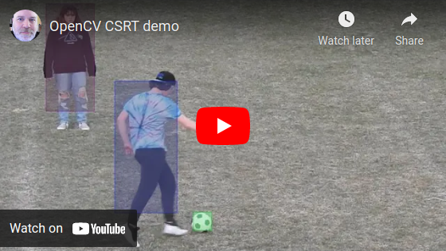

# CSRT Example

[](https://www.youtube.com/watch?v=wdZGcKh1fh4)

## Media files

The input videos are not checked in to github since they're over 100 MiB in size.  You can download them from here:  https://www.ccoderun.ca/download/media/

## Build and run

Assuming you've downloaded the example input videos described above, run the following commands to build and run the CSRT example on Ubuntu:

```
sudo apt-get install build-essential cmake libopencv-dev
mkdir -p ~/src
cd ~/src
git checkout https://github.com/stephanecharette/CSRTExample
cd CSRTExample
mkdir build
cd build
cmake ..
make
./CSRTExample input_3733.mp4
```
